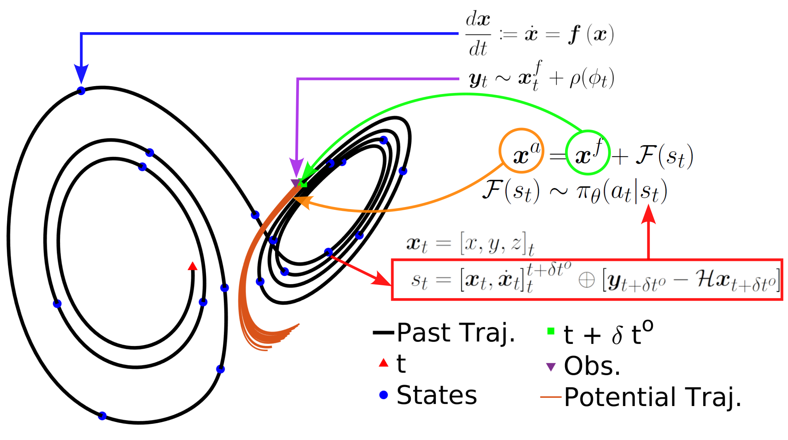

<div align="center">

# DA-RL: Data Assimilation in Chaotic Systems Using Deep Reinforcement Learning 

<div>
  <a href="https://scholar.google.com/citations?user=fzG5VxsAAAAJ&hl=en">Abed Hammoud</a><sup>1</sup>&nbsp;&nbsp;
  <a href="https://scholar.google.com/citations?user=r4wrjtsAAAAJ&hl=en">Naila Raboudi</a><sup>1</sup>&nbsp;&nbsp;
  <a href="https://scholar.google.com/citations?user=VrQC0_gAAAAJ&hl=en">Edriss S. Titi</a><sup>2,3</sup>&nbsp;&nbsp;
  <a href="https://scholar.google.com/citations?user=KuvOKcwAAAAJ&hl=en">Omar Knio</a><sup>1</sup>&nbsp;&nbsp;
  <a href="https://scholar.google.com/citations?user=Ez_xk3sAAAAJ&hl=en">Ibrahim Hoteit</a><sup>1</sup>&nbsp;&nbsp;
  <br>
  <sup>1</sup> KAUST,
  <sup>2</sup> University of Cambridge,
  <sup>3</sup> Texas A&M
</div>

---

 <!-- Sets the width to 500 pixels -->

[](https%3A%2F%2Fagupubs.onlinelibrary.wiley.com%2Fdoi%2F10.1029%2F2023MS004178%3Faf%3DR)

🔥 **Stay tuned for updates, and don't forget to star this repo for the latest on DA-RL!** 🔥

</div>
   
## 📜 Abstract
We introduce a new data assimilation framework that employs deep reinforcement learning (RL) to apply state corrections using full or partial observations of the state variables. This approach significantly departs from other emerging deep learning approaches in this domain, where RL utilizes the numerical discretization of the a dynamical model and learns a state correction strategy, which satisfies some pre-determined optimality criteria, through series of trial and error. As opposed to the commonly used ensemble Kalman filter (EnKF), our correction is nonlinear and generalizes to non-Gaussian noise models. Leveraging recent advances in RL, we are able to employ a stochastic action policy to assimilate non-Gaussian observations, addressing one of the limitations of the EnKF. Furthermore, numerical results demonstrate that the developed RL algorithm performs favorably when compared to the EnKF for the range of experiments focusing on the Lorenz 63 and 96 that were conducted in this study.

## 🚀 Getting Started

### Environment Setup
First, let's set up the Conda environment to get you up and running. For simplicity, the RL environment is provided in the repo. Simply create a new environment using the provide YAML file.

```bash
conda env create -f RL_env.yml
```


## 📁 Project Structure and Execution Order

Our project is organized into three main folders: Lorenz 63, Lorenz 96 and post-processing. The RL environments for the base case (standard Gaussian noise model, assimilating observations once every 50 time steps with full state observations) are provided for both dynamical systems. In addition, the case of lognormal noise model, and partial osbervations are provided for the Lorenz 63 chaotic system.

### Folders and Their Functions:
1. **`Lorenz 63`**: Includes all the necessary codes to train and evaluate the DA-RL model for the Lorenz 63 case. The folder includes 3 cases that can easily be extended to any case similar to those presented in the manuscript.  

1. **`Lorenz 96`**: Includes the lognormal model noise case study for the Lorenz 96 model. 

3. **`DA_RL_plots`**: This folder contains all the pretrained models, and the relevant post-processing codes to visualize the time evolution of the errors and the state variables. 


## 📦 Trained Models
Jumpstart your experiments with our pre-trained Lorenz 63 DA-RL models and post-processing codes:

- Assimilation with **different noise levels** ➡️ [Download](https://drive.google.com/drive/folders/1gEbldbMDVeXaeojfXrJDiwHZls8X_WvV?usp=sharing)
- Assimilation with **different assimilation periods** ➡️ [Download](https://drive.google.com/drive/folders/1S3ye9UGriHMhVqNjMxtQqHX-WNwIQmtr?usp=sharing)
- Assimilation with **different noise models** ➡️ [Download](https://drive.google.com/drive/folders/1Lq_1MXG8BL-diuD9NNijLscBYmtebr5v?usp=sharing)
- Assimilation with **partial observations** ➡ [Download](https://drive.google.com/drive/folders/15lKlQQhBI3t8Q7PCGdL_ztnW6fjdD0Yx?usp=sharing) 
- **Tracking a noise-free solution** ➡ [Download](https://drive.google.com/drive/folders/1wndSifaIQhEe0yVjwlN9cafStPDLmklO?usp=sharing) 


## 📖 Citation
If you find DA-RL useful in your research, please consider citing:

```bibtex
@article{https://doi.org/10.1029/2023MS004178,
author = {Hammoud, Mohamad Abed El Rahman and Raboudi, Naila and Titi, Edriss S. and Knio, Omar and Hoteit, Ibrahim},
title = {Data Assimilation in Chaotic Systems Using Deep Reinforcement Learning},
journal = {Journal of Advances in Modeling Earth Systems},
volume = {16},
number = {8},
keywords = {data assimilation, deep reinforcement learning, Lorenz, artificial intelligence, control, chaos},
doi = {https://doi.org/10.1029/2023MS004178},
url = {https://agupubs.onlinelibrary.wiley.com/doi/abs/10.1029/2023MS004178},
year = {2024}
}

```

---